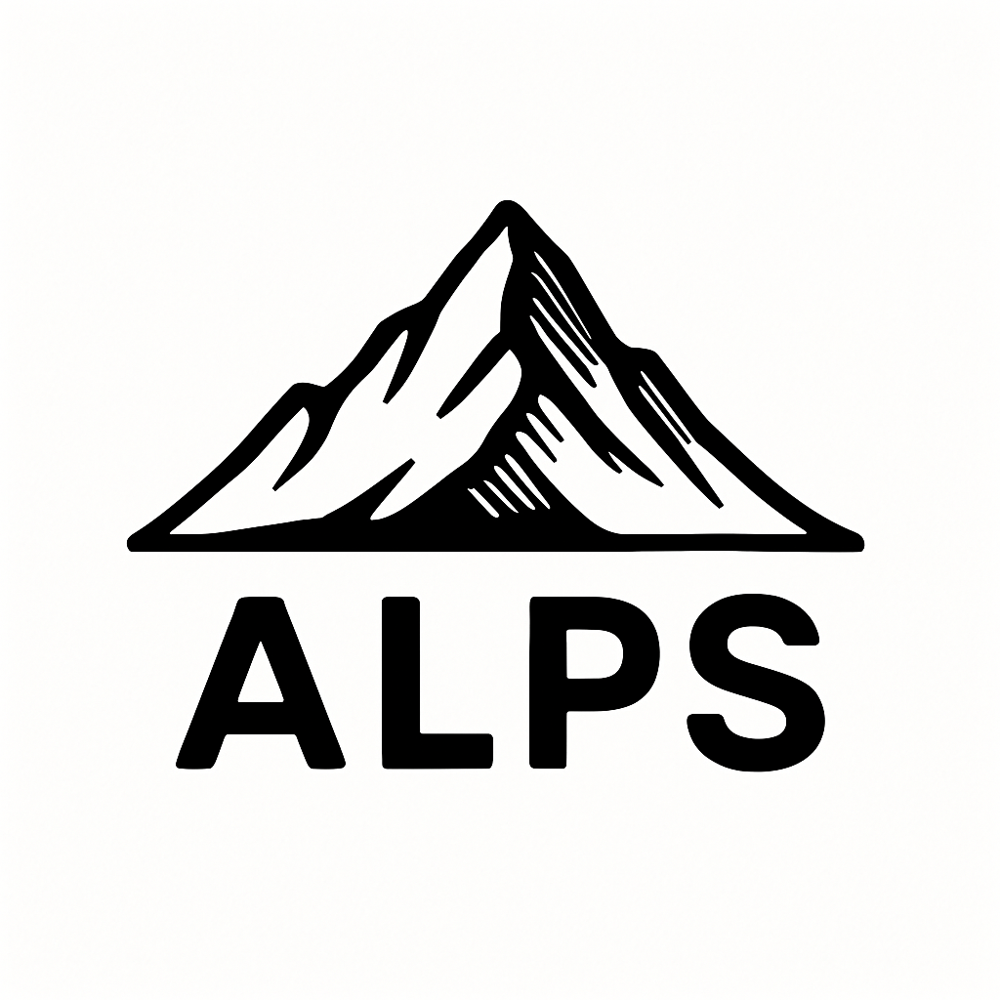

<p>
  
</p>

# Automatic Least-Privilege Policy Suggestor (ALPS)

This repository contains code for **Automatic Least-Privilege Policy Suggestor (ALPS)**—my Spring 2025 **Software & Systems Security Project**.

## Overview

ALPS is an **AWS IAM least-privilege policy suggestor/generator** for **AWS Cloud Workflows**. It is designed for integration with the [AWS Cloud Development Kit (CDK)](https://aws.amazon.com/cdk/).

At a high level, ALPS:

- Parses synthesized **Python CDK** code

- Identifies **insecure IAM policies**

- Suggests **more secure IAM policies** in the form of:
  - **Descriptive security recommendations**
  - **Python CDK code**

## Installation

Install locally:

```sh
git clone https://github.com/Marcus-Adair/alps_project.git

cd alps_project

sudo pip install --editable . # Enter in password after

```

### Prerequisite: `jq`

ALPS requires [`jq`](https://stedolan.github.io/jq/) to be installed on your system. `jq` is a lightweight and flexible command-line JSON processor used to parse AWS CDK output files.

#### Install `jq`. The easiest way is through `brew`:

```sh
brew install jq
```

## Usage

- After installation, navigate to the base directory of your CDK project and run ALPS using the following command:
  `alps`

- To view all available options for running ALPS, use the command:
  `alps -h`

- To run ALPS from any location and specify the base directory of your CDK project, use the following command:
  `alps -c <base_dir>`
  where `<base_dir>` is the path to your CDK project.

- To execute ALPS in verbose mode and display additional information, use:
  `alps -v`

- The security vulnerability warning and Python code suggestions from ALPS will be printed to the console.

## Testing

- [This directory](./tests/) contains unit tests for ALPS.

- To run the unit tests insall `pytest` with `pip`:

```sh
pip install pytest
```

- And in the repo's [base directory](./) or the [tests directory](./tests/), run the following command to run the unit tests:

```sh
pytest
```

## Additional Notes:

- ALPS assumes that user policies are named and do not contain "DefaultPolicy". If "DefaultPolicy" is contained in a manually created policy then ALPS will ignore it.
